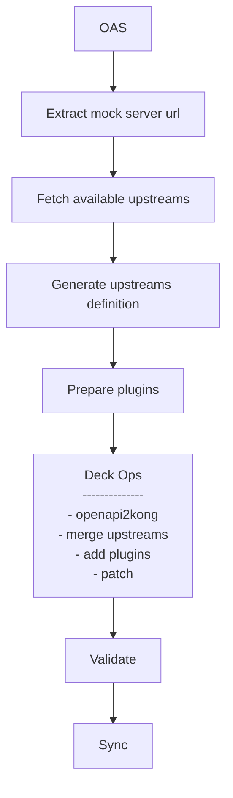

# Backend discovery with upstreams example

This demo showcases how Kong can proxy requests to various backends located in different geographical regions 
by utilizing `upstreams` in combination with the `Request Transformer Advanced` and `Route by Header` plugins.

The configurations for `upstreams` and `plugins` are dynamically applied and managed based on records provided by an `Upstream Registry` service.

## Useful links
- [Request Transformer Advanced Plugin](https://docs.konghq.com/hub/kong-inc/request-transformer-advanced/)
- [Route by Header Plugin](https://docs.konghq.com/hub/kong-inc/route-by-header/)
- [Kong Upstreams](https://docs.konghq.com/gateway/latest/key-concepts/upstreams/)

## Prerequisites
- Docker and docker compose
- [Nektos/act](https://github.com/nektos/act)

## Demo components

1. Kong
2. Upstream Registry service (http://localhost:3000)
3. 3 Echo servers representing EU, US, CH backends

## Important files

1. OAS: `openapi.yaml`
2. Kong Plugins template: `plugins/plugins.json`
3. Workflow: `.github/workflows/promote-api.yaml`

## Spin up the environment

```bash
$ docker compose up -d
```

## Workflow



## Run the workflow

```bash
$ act --input openapi_spec=openapi.yaml -W .github/workflows/promote-api.yaml
```