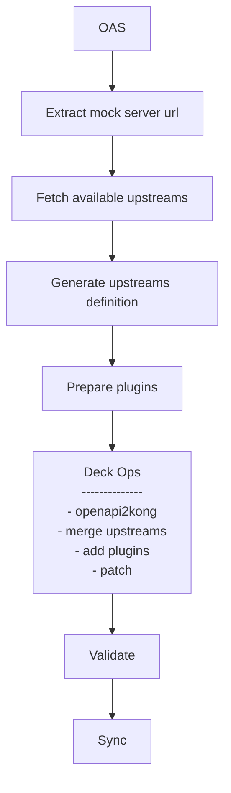

# Backend discovery with upstreams example

This demo showcases how Kong can proxy requests to various backends located in different geographical regions 
by utilizing `upstreams` in combination with the `Request Transformer Advanced` and `Route by Header` plugins.

The configurations for `upstreams` and `plugins` are dynamically applied and managed based on records provided by an `Upstream Registry` service.

## Useful links
- [Request Transformer Advanced Plugin](https://docs.konghq.com/hub/kong-inc/request-transformer-advanced/)
- [Route by Header Plugin](https://docs.konghq.com/hub/kong-inc/route-by-header/)
- [Kong Upstreams](https://docs.konghq.com/gateway/latest/key-concepts/upstreams/)

## Prerequisites
- Docker and docker compose
- [Nektos/act](https://github.com/nektos/act)

## Demo components

1. Kong
2. Upstream Registry service (http://localhost:3000)
3. 3 Echo servers representing EU, US, CH backends

## Important files

1. OAS: `openapi.yaml`
2. Kong Plugins template: `plugins/plugins.json`
3. Workflow: `.github/workflows/promote-api.yaml`

## Spin up the environment

```bash
$ docker compose up -d
```

## Workflow



## Run the workflow

```bash
$ act --input openapi_spec=openapi.yaml -W .github/workflows/promote-api.yaml
```

## Testing the implementation

### Proxy to the default EU backend
```bash
$ curl http://localhost:8000/pets

Hostname: svc-eu
IP: 127.0.0.1
IP: ::1
IP: 192.168.0.5
RemoteAddr: 192.168.0.10:47246
GET /pets HTTP/1.1
Host: svc-eu
User-Agent: curl/8.6.0
Accept: */*
Connection: keep-alive
Location: 
X-Forwarded-For: 192.168.65.1
X-Forwarded-Host: localhost
X-Forwarded-Path: /pets
X-Forwarded-Port: 8000
X-Forwarded-Proto: http
X-Kong-Request-Id: 58542c61978b5163d797e0612b8b2773
X-Real-Ip: 192.168.65.1
```

### Proxy to the US backend by query param
```bash
$ curl http://localhost:8000/pets\?location\=us
Hostname: svc-us
IP: 127.0.0.1
IP: ::1
IP: 192.168.0.2
RemoteAddr: 192.168.0.10:44646
GET /pets?location=us HTTP/1.1
Host: svc-us
User-Agent: curl/8.6.0
Accept: */*
Connection: keep-alive
Location: us
X-Forwarded-For: 192.168.65.1
X-Forwarded-Host: localhost
X-Forwarded-Path: /pets
X-Forwarded-Port: 8000
X-Forwarded-Proto: http
X-Kong-Request-Id: 3c87c606077314663ff7b8793460af68
X-Real-Ip: 192.168.65.1
```
### Proxy to the CH backend by path
```bash
$ curl http://localhost:8000/ch/pets           
Hostname: svc-ch
IP: 127.0.0.1
IP: ::1
IP: 192.168.0.3
RemoteAddr: 192.168.0.10:33698
GET /ch/pets HTTP/1.1
Host: svc-ch
User-Agent: curl/8.6.0
Accept: */*
Connection: keep-alive
Location: ch
X-Forwarded-For: 192.168.65.1
X-Forwarded-Host: localhost
X-Forwarded-Path: /ch/pets
X-Forwarded-Port: 8000
X-Forwarded-Proto: http
X-Kong-Request-Id: d3b5341f5685b82277d3fb3950a8551d
X-Real-Ip: 192.168.65.1
```