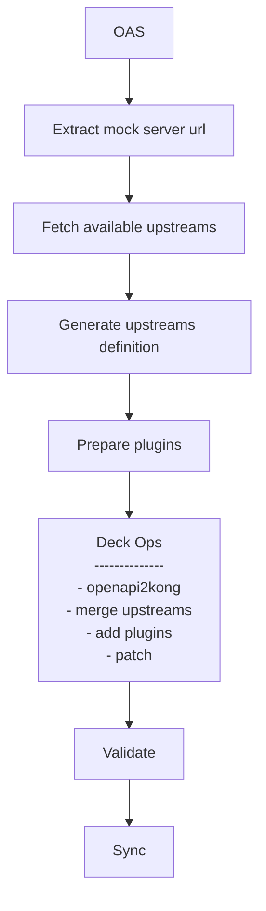

# Backend discovery with upstreams example

## Workflow

```mermaid
graph TB;
    A[OAS]
    B[Extract mock server url]
    C[Fetch available upstreams]
    D[Generate upstreams definition]
    E[Prepare plugins]
    F["Deck Ops
        --------------
        - openapi2kong
        - merge upstreams
        - add plugins
        - patch
    "]
    G[Validate]
    H[Sync]

    A --> B --> C --> D --> E --> F --> G --> H
```